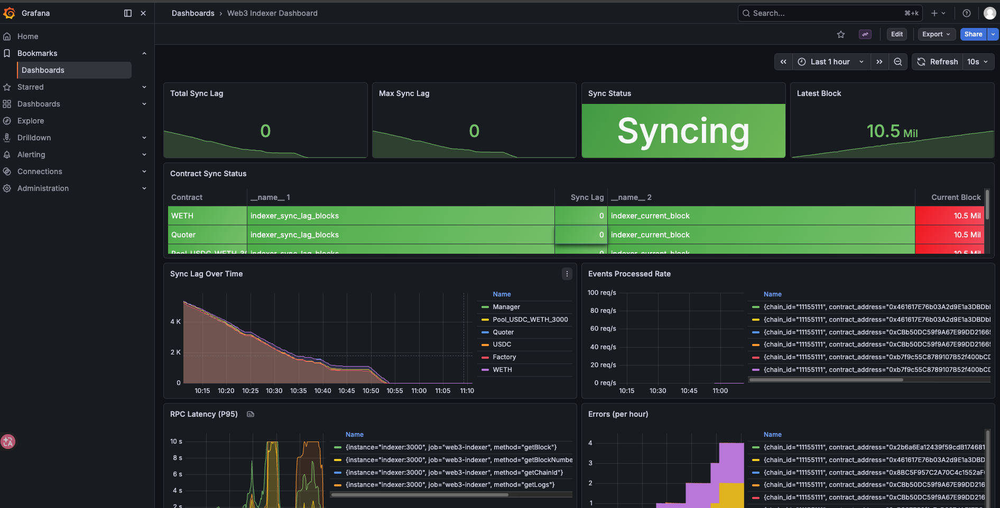

# Web3 Indexer

[](https://www.typescriptlang.org/)
[](https://nodejs.org/)
[](https://opensource.org/licenses/MIT)

**[中文文档](./README_CN.md)**

A production-grade Web3 off-chain indexing service with REST and GraphQL APIs, designed for Ethereum and EVM-compatible chains.

## ✨ Features

- **🔄 Reliable Sync** - Resume from breakpoint, auto-retry, chain reorganization detection & recovery
- **⚡ High Performance** - Batch fetching, concurrency control, incremental sync
- **🔌 Dual API Support** - REST API + GraphQL API
- **📊 Observability** - Structured logging, Prometheus metrics, health checks
- **🔐 Production Ready** - JWT authentication, rate limiting, distributed locking
- **🛠 Type Safe** - Full type safety with TypeScript + Prisma + Zod

## 📐 Architecture

```
┌─────────────────────────────────────────────────────────────────────┐
│                        Web3 Indexer Service                         │
├─────────────────────────────────────────────────────────────────────┤
│  Config Manager  │  Logger (Pino)  │  Metrics (Prometheus)          │
├─────────────────────────────────────────────────────────────────────┤
│                        Block Synchronizer                            │
│     RPC Client (Viem)  │  Block Fetcher  │  Reorg Handler          │
├─────────────────────────────────────────────────────────────────────┤
│                        Event Processor                               │
│     Log Filter  │  ABI Decoder  │  Handlers (ERC20, Swap, Custom) │
├─────────────────────────────────────────────────────────────────────┤
│                        Data Storage Layer                            │
│  SyncState  │  Events  │  Transfers  │  Checkpoints  │  KeyValue   │
│                    PostgreSQL / SQLite                               │
├─────────────────────────────────────────────────────────────────────┤
│                           API Layer                                  │
│        REST API (Fastify)     │     GraphQL (Apollo Server)        │
│        Auth & Rate Limiting   │     Playground (Dev Mode)          │
└─────────────────────────────────────────────────────────────────────┘
```

## 🚀 Quick Start

### Requirements

- Node.js >= 18.0.0
- PostgreSQL 15+ (production) or SQLite (development)
- Redis (optional, for distributed locking)

### Installation

```bash
# Clone the project
git clone <repository-url>
cd indexer

# Install dependencies
npm install

# Configure environment variables
cp .env.example .env
```

### Configuration

Edit the `.env` file:

```env
# Server
NODE_ENV=development
PORT=3000
LOG_LEVEL=debug

# Database
DATABASE_URL="file:./dev.db"

# Blockchain RPC
RPC_URL=https://eth-mainnet.g.alchemy.com/v2/YOUR_API_KEY
CHAIN_ID=1

# Sync
START_BLOCK=0
BATCH_SIZE=100
CONFIRMATIONS=12
SYNC_INTERVAL=1000

# Contracts (JSON array)
CONTRACTS='[{"name":"USDT","address":"0xdAC17F958D2ee523a2206206994597C13D831ec7","startBlock":4634748}]'
```

### Start

```bash
# Initialize database
npm run db:push

# Development mode
npm run dev

# Production build
npm run build
npm start
```

After starting, access:
- REST API: http://localhost:3000
- GraphQL Playground: http://localhost:3000/graphql (dev mode only)
- Health Check: http://localhost:3000/health

## 📖 API Documentation

### REST API

#### Health Check

```http
GET /health          # Service health status
GET /ready           # Service ready status
```

#### Sync Status

```http
GET /api/v1/sync/status      # All contracts sync status
GET /api/v1/sync/metrics     # Sync metrics
GET /api/v1/sync-states      # Sync state list
```

#### Events

```http
# Query events
GET /api/v1/events?chainId=1&contractAddress=0x...&eventName=Transfer&limit=100

# Event count
GET /api/v1/events/count?chainId=1&contractAddress=0x...

# Event names
GET /api/v1/events/names?chainId=1&contractAddress=0x...
```

#### Transfer Events

```http
# Query transfers
GET /api/v1/transfers?chainId=1&from=0x...&to=0x...&limit=100

# Transfer count
GET /api/v1/transfers/count?chainId=1&contractAddress=0x...

# Address transfer history
GET /api/v1/transfers/address/:address?chainId=1
```

### GraphQL API

Visit `http://localhost:3000/graphql` for GraphQL Playground.

#### Query Examples

```graphql
# Sync status
query SyncStatus {
  syncStatus {
    contractName
    lastSyncedBlock
    latestBlock
    blocksBehind
    isSyncing
  }
}

# Transfer events
query Transfers {
  transfers(
    filter: { chainId: 1, contractAddress: "0xdAC17F958D2ee523a2206206994597C13D831ec7" }
    limit: 10
  ) {
    from
    to
    value
    valueFormatted
    tokenSymbol
    blockNumber
    txHash
    blockTimestamp
  }
}

# Address transfer history
query AddressHistory {
  address(chainId: 1, address: "0x...") {
    transfers(limit: 20) {
      tokenSymbol
      from
      to
      valueFormatted
      direction
      blockNumber
      txHash
    }
  }
}

# Contract events
query ContractEvents {
  contract(chainId: 1, address: "0xdAC17F958D2ee523a2206206994597C13D831ec7") {
    name
    syncState {
      lastSyncedBlock
      isSyncing
    }
    events(eventName: "Transfer", limit: 10) {
      eventName
      args
      blockNumber
      txHash
    }
  }
}
```

## ⚙️ Configuration

### Environment Variables

| Variable | Description | Default |
|----------|-------------|---------|
| `NODE_ENV` | Environment | `development` |
| `PORT` | API port | `3000` |
| `LOG_LEVEL` | Log level | `info` |
| `DATABASE_URL` | Database connection | `file:./dev.db` |
| `RPC_URL` | Blockchain RPC URL (single chain) | - |
| `CHAIN_ID` | Chain ID (single chain) | `1` |
| `CHAINS` | Multi-chain config (JSON) | - |
| `START_BLOCK` | Starting block | `0` |
| `BATCH_SIZE` | Batch size | `100` |
| `CONFIRMATIONS` | Confirmations needed | `12` |
| `SYNC_INTERVAL` | Sync interval (ms) | `1000` |
| `MAX_CONCURRENT_REQUESTS` | Max concurrent requests | `5` |
| `CONTRACTS` | Contract config (JSON) | `[]` |
| `AUTH_ENABLED` | Enable JWT auth | `false` |
| `JWT_SECRET` | JWT secret | - |
| `RATE_LIMIT_ENABLED` | Enable rate limiting | `true` |
| `RATE_LIMIT_MAX` | Rate limit threshold | `100` |
| `REDIS_URL` | Redis connection | - |

### Single Chain Configuration

Use `RPC_URL` and `CHAIN_ID` for single chain:

```env
RPC_URL=https://eth-mainnet.g.alchemy.com/v2/YOUR_API_KEY
CHAIN_ID=1

CONTRACTS='[{"name":"USDT","address":"0xdAC17F958D2ee523a2206206994597C13D831ec7","startBlock":4634748}]'
```

### Multi-Chain Configuration

Use `CHAINS` environment variable for multi-chain, specify `chainId` in contracts:

```env
CHAINS='[
  {"id":1,"name":"ethereum","rpcUrl":"https://eth-mainnet.g.alchemy.com/v2/KEY1"},
  {"id":137,"name":"polygon","rpcUrl":"https://polygon-mainnet.g.alchemy.com/v2/KEY2"},
  {"id":42161,"name":"arbitrum","rpcUrl":"https://arb-mainnet.g.alchemy.com/v2/KEY3"}
]'

CONTRACTS='[
  {"name":"USDT-Ethereum","address":"0xdAC17F958D2ee523a2206206994597C13D831ec7","chainId":1,"startBlock":4634748},
  {"name":"USDT-Polygon","address":"0xc2132D05D31c914a87C6611C10748AEb04B58e8F","chainId":137,"startBlock":25117600},
  {"name":"USDT-Arbitrum","address":"0xFd086bC7CD5C481DCC9C85ebE478A1C0b69FCbb9","chainId":42161,"startBlock":100000}
]'
```

**Chain Configuration Fields:**

| Field | Required | Description |
|-------|----------|-------------|
| `id` | ✅ | Chain ID (1=Ethereum, 137=Polygon, 42161=Arbitrum, etc.) |
| `name` | ❌ | Chain name (optional, auto-inferred) |
| `rpcUrl` | ✅ | RPC endpoint URL |
| `blockTime` | ❌ | Block time in ms (optional, auto-inferred) |

**Contract Configuration Fields:**

| Field | Required | Description |
|-------|----------|-------------|
| `name` | ✅ | Contract name (for identification) |
| `address` | ✅ | Contract address |
| `chainId` | ❌ | Chain ID (defaults to first chain if not specified) |
| `startBlock` | ✅ | Block to start indexing from |
| `abi` | ❌ | Contract ABI (optional) |
| `events` | ❌ | Events to index (optional, defaults to all) |

## 🔧 Custom Event Processor

### Create Processor

```typescript
import { EventProcessor, createEventSignature } from './processor/index.js';
import type { Abi } from 'viem';

const MY_ABI: Abi = [
  {
    anonymous: false,
    inputs: [
      { indexed: true, name: 'user', type: 'address' },
      { indexed: false, name: 'amount', type: 'uint256' },
    ],
    name: 'Deposit',
    type: 'event',
  },
];

class MyEventProcessor extends EventProcessor {
  constructor(db: PrismaClient, logger: Logger) {
    super(logger);

    const depositEvent = MY_ABI.find(e => e.type === 'event' && e.name === 'Deposit')!;
    this.registerEvent({
      signature: createEventSignature(depositEvent),
      abi: depositEvent,
      handler: this.handleDeposit.bind(this),
    });
  }

  private async handleDeposit(event, context) {
    const { user, amount } = event.args;
    // Custom processing logic...
  }
}
```

### Register to Synchronizer

```typescript
const myProcessor = new MyEventProcessor(db, logger);

const synchronizer = new Synchronizer(config, db, logger, async (params) => {
  await myProcessor.processLogs(params.logs, params, { db, logger });
});
```

## 🐳 Docker Deployment

### Using Docker Compose

```bash
# Create environment file
cp .env.example .env

# Start all services
docker-compose up -d

# Start with monitoring
docker-compose --profile monitoring up -d
```

Service components:
- **indexer** - Main service (port 3000)
- **postgres** - PostgreSQL database (port 5432)
- **redis** - Distributed locking (port 6379)
- **prometheus** - Metrics collection (port 9090)
- **grafana** - Visualization dashboard (port 3001)

### Manual Build

```bash
docker build -t web3-indexer .
docker run -p 3000:3000 --env-file .env web3-indexer
```

## 📁 Project Structure

```
indexer/
├── src/
│   ├── index.ts                 # Entry point
│   ├── config/                  # Configuration management
│   │   ├── index.ts
│   │   └── schema.ts            # Zod config validation
│   ├── sync/                    # Synchronizer
│   │   ├── rpc-client.ts        # RPC client
│   │   ├── block-fetcher.ts     # Block fetcher
│   │   ├── reorg-handler.ts     # Reorg handler
│   │   └── synchronizer.ts      # Synchronizer core
│   ├── processor/               # Event processor
│   │   ├── event-processor.ts
│   │   └── handlers/
│   │       └── erc20.handler.ts
│   ├── storage/                 # Data storage
│   │   ├── database.ts
│   │   └── repositories/
│   ├── api/                     # API layer
│   │   ├── server.ts            # REST API
│   │   └── graphql/             # GraphQL API
│   ├── middleware/              # Middleware
│   │   ├── auth.ts              # JWT auth
│   │   └── rate-limit.ts        # Rate limiting
│   ├── lock/                    # Distributed lock
│   ├── monitoring/              # Monitoring metrics
│   ├── utils/                   # Utilities
│   └── types/                   # Type definitions
├── prisma/
│   └── schema.prisma            # Database schema
├── abis/                        # Contract ABI files
├── monitoring/                  # Monitoring config
│   ├── prometheus.yml
│   └── grafana/
├── .env.example
├── docker-compose.yml
├── Dockerfile
└── package.json
```

## 🧪 Development

```bash
# Development mode (hot reload)
npm run dev

# Type check
npm run typecheck

# Lint
npm run lint

# Run tests
npm test

# Test coverage
npm run test:coverage

# Database management
npm run db:studio    # Open Prisma Studio
npm run db:migrate   # Create migration
```

## 📊 Monitoring

### Prometheus Metrics

- `indexer_sync_blocks_total` - Total synced blocks
- `indexer_sync_events_total` - Total processed events
- `indexer_sync_duration_seconds` - Sync duration
- `indexer_rpc_requests_total` - Total RPC requests
- `indexer_rpc_errors_total` - Total RPC errors

### Grafana Dashboard



After starting monitoring services, visit `http://localhost:3001`, default credentials `admin/admin`.

## 🗺️ Roadmap

### v2.0 - Performance & Real-time

- [ ] **Message Queue Integration** - Introduce message queue (BullMQ/Redis Streams) to decouple block fetching from event processing, enabling horizontal scaling and backpressure control
- [ ] **Caching Layer** - Add Redis-based caching for hot data (latest blocks, frequent address queries) to reduce database load and improve API response times
- [ ] **WebSocket Support** - Implement WebSocket API for real-time event notifications, sync status updates, and frontend subscriptions

### Future

- [ ] Horizontal scaling with multiple indexer instances
- [ ] Event replay and re-indexing capabilities
- [ ] Custom webhook integrations

## 📄 License

MIT